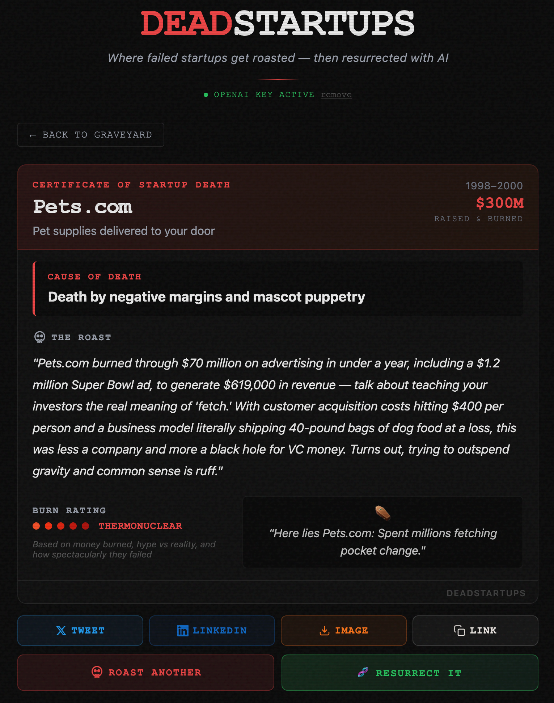

# DeadStartups

Where failed startups get roasted, then resurrected with AI.

Pick a failed startup from the graveyard, get a brutal AI-generated roast with real research, then see how to rebuild it with modern tech.

## Screenshots

## Features

- **AI-Powered Roasts**: Research-backed roasts with real data on what went wrong
- **Burn Rating**: From "Mild Singe" to "Thermonuclear" based on money burned, hype vs reality
- **Custom Roasts**: Enter any startup name for a custom roast
- **Pre-Mortem Analysis**: Predict how a startup idea will fail before it happens
- **Resurrection Mode**: AI-generated plan to rebuild the failed startup with modern tech
- **Social Sharing**: Share roasts on Twitter/X and LinkedIn, or download as images
- **BYOK Support**: Bring your own OpenAI, Anthropic, or Gemini API key

## Tech Stack

- Node.js / Express
- Server-Sent Events (SSE) for streaming
- OpenAI / Anthropic / Gemini for AI generation
- Supabase for caching and analytics
- Vanilla JS frontend

## Live Demo

[narasimha-badrinath.com/deadstartups](https://narasimha-badrinath.com/deadstartups/)
